# LABORATORIO 3 - TDD
ESCUELA COLOMBIANA DE INGENIERÍA - CICLOS DE VIDA DE DESARROLLO DE SOFTWARE
#### TALLER 3
##### Testing - TDD

---

## Integrantes
- Geronimo Martinez Nuñez.
- Carlos David Barrero Velasquez.

---

## DESCRIPCIÓN PROYECTO
El proyecto consiste en un sistema de gestión de bibliotecas, donde hay clases que representan ```Libro```, ```Usuario```, ```Prestamo```, y ```Biblioteca```. Los usuarios pueden tomar prestados libros de la biblioteca, y la Biblioteca se encarga de gestionar los préstamos, asegurarse de que los libros estén disponibles, y mantener un registro de los libros prestados.
### CREAR PROYECTO CON MAVEN
Deben crear un proyecto maven con los siguientes parámetros:
```yml
Grupo: edu.eci.cvds 
Artefacto: Library 
Paquete: edu.eci.cvds.tdd 
archetypeArtifactId: maven-archetype-quickstart 
```
### AGREGAR DEPENDENCIA JUNIT5
- Buscar en maven central la dependencia de JUnit5 en su versión más reciente.
- Edite el archivo pom.xml del proyecto para agregar la dependencia.
- Verifique que la versión de java sea la 17
```xml
<properties>
  <maven.compiler.target>1.8</maven.compiler.target>
  <maven.compiler.source>1.8</maven.compiler.source>
</properties>
```
### AGREGAR ESQUELETO DEL PROYECTO
Cree los siguientes paquetes dentro de ```edu.eci.cvds.tdd```
- library
  - book
  - loan
  - user
Estos paquetes también se deben crear en la carpeta de test.
## Respuestas ✅
Aca se muestra la estrucuta del proyecto.

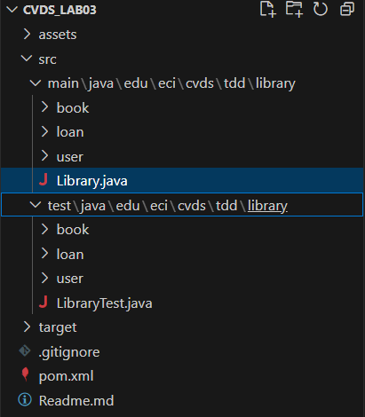

---

### AGREGAR CLASES
### CREAR CLASE DE PRUEBA
Es necesario crear la clase de prueba para ```edu.eci.cvds.tdd.Library```, la clase debe seguir los estándares de nombres estudiados en clase.
 
## Respuestas ✅
En el paquete ```edu.eci.cvds.tdd.library.book```
En el paquete ```edu.eci.cvds.tdd.library.user```
En el paquete ```edu.eci.cvds.tdd.library.loan```
Por último se debe crear la siguiente clase en el paquete ```edu.eci.cvds.tdd.library```
Aca podemos observar los .java de las clases en sus respectivas localizaciones y además se muestra el espejo de la estructura en Test

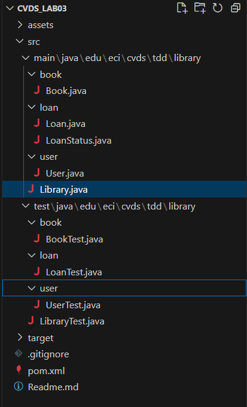

---

## PRUEBAS UNITARIAS Y TDD
Para poder implementar los métodos ```addBook, loanABook y returnLoan``` de la clase ```Library``` vamos a aplicar la técnica de TDD, por cada caso de prueba se debe hacer un commit, cada commit debe tener la prueba nueva y la implementación para que la prueba del commit funcione. Las pruebas anteriormente implementadas deben continuar funcionando.
### COBERTURA
- Agregar la dependencia de jacoco, utilizar la última versión disponible en maven central.
## Respuestas ✅
Aca podemos observar la implementación de jacoco al pom para su correcto funcionamiento.

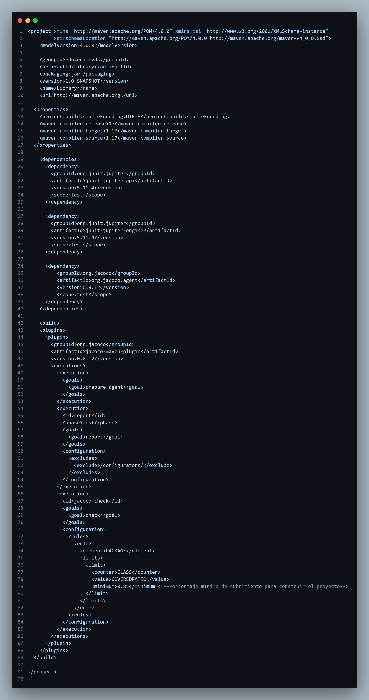

Aca mostraremos el paso a paso de las pruebas unitarias y tdd.

Que consta de la creación de las pruebas, luego verificar que efectivamente fallaron pero no dieron errores y finalmente los ultimos dos pasos son la creacion del codigo necesario para hacer que funcionen la pruebas y verificar que si pasaron esas pruebas.

#### AddBook
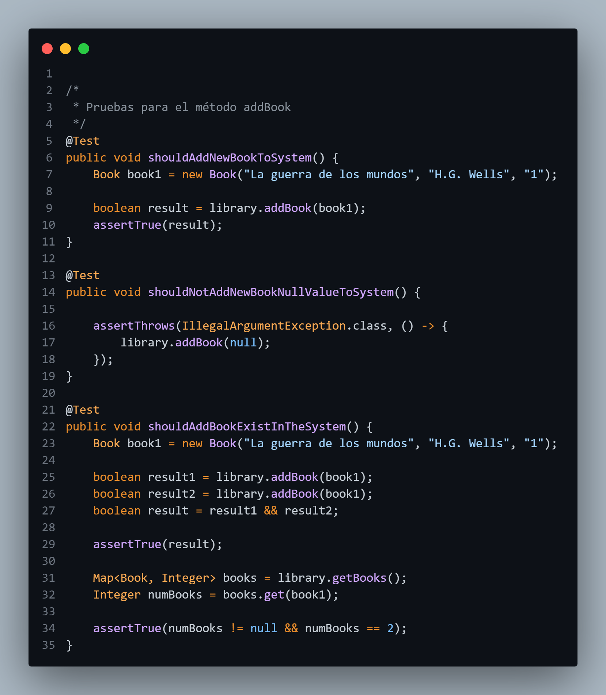
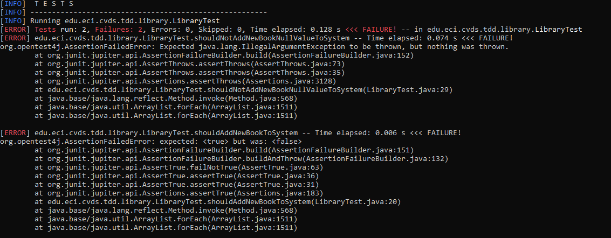
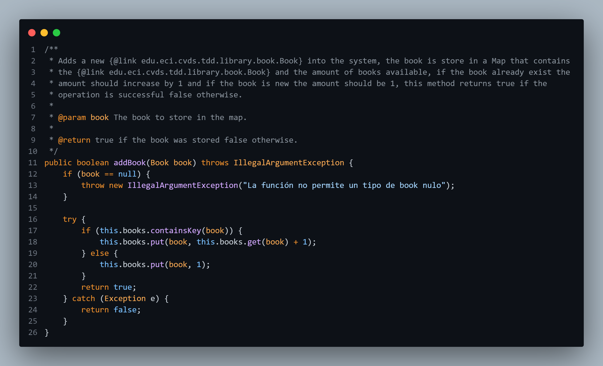
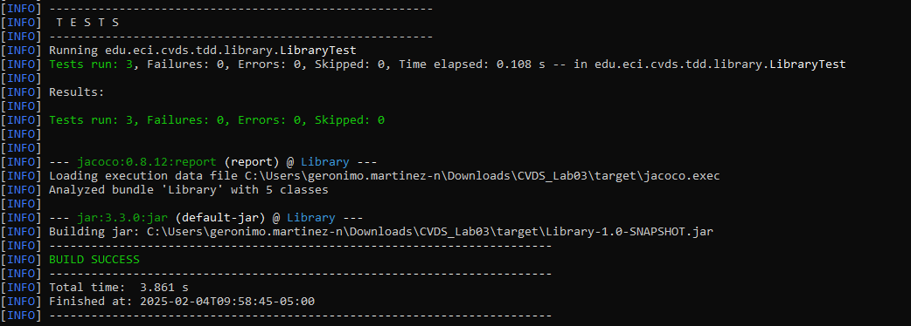

#### LoanABook

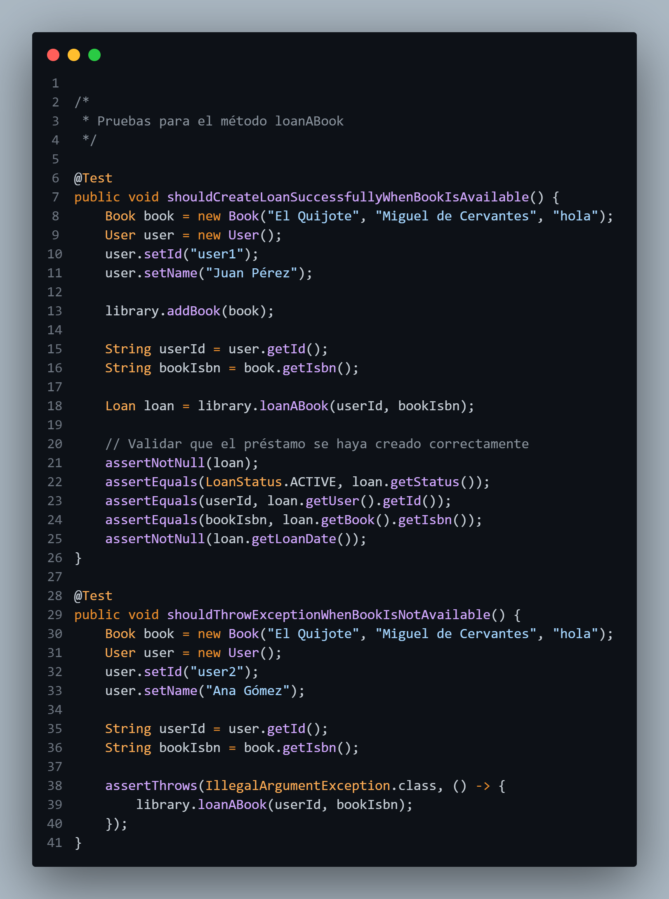
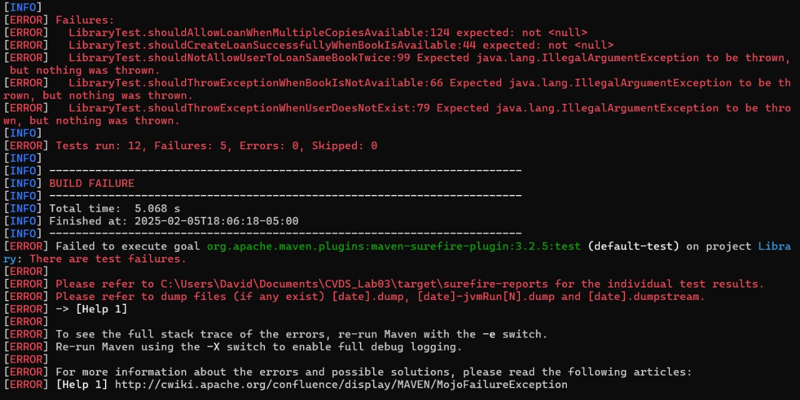
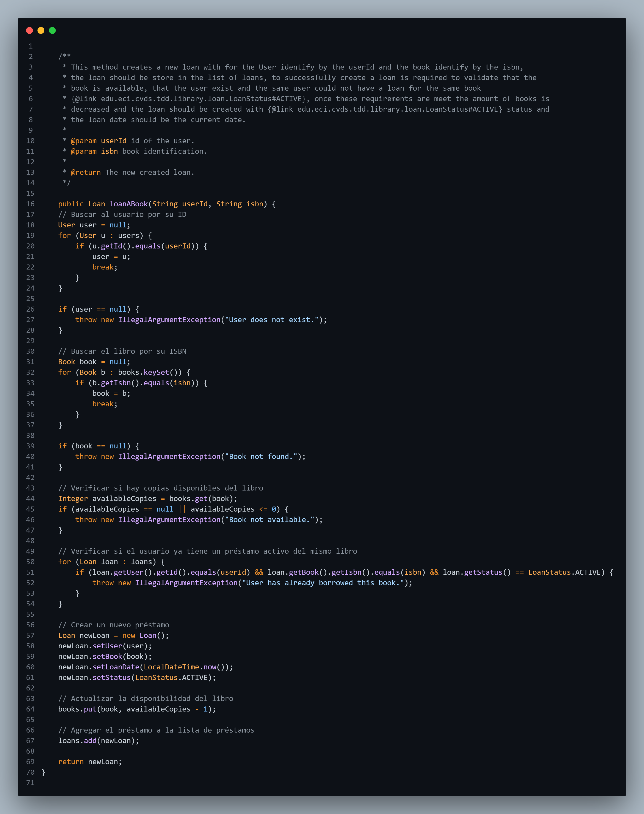
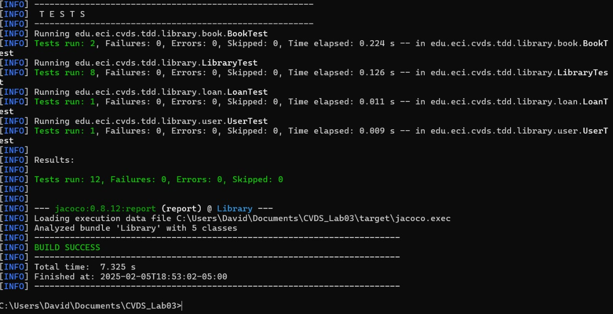

#### LoanABook

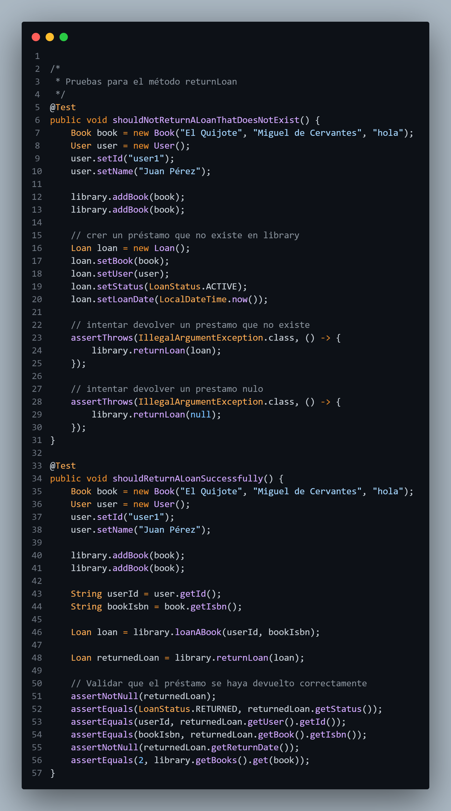
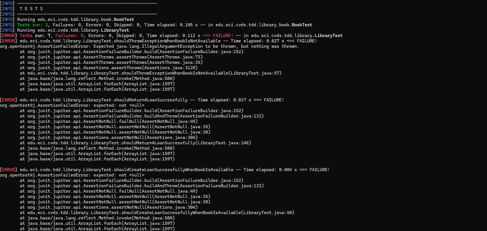
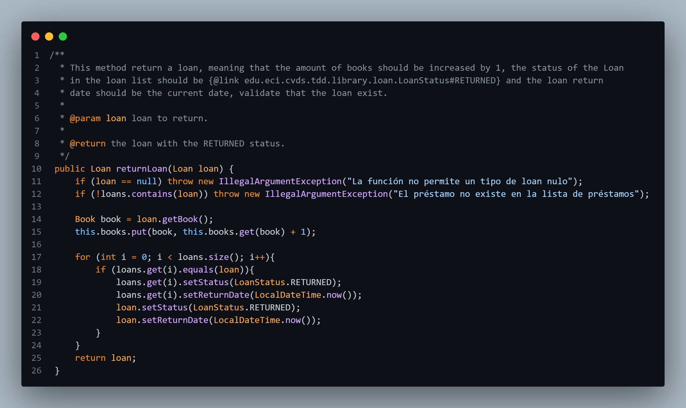
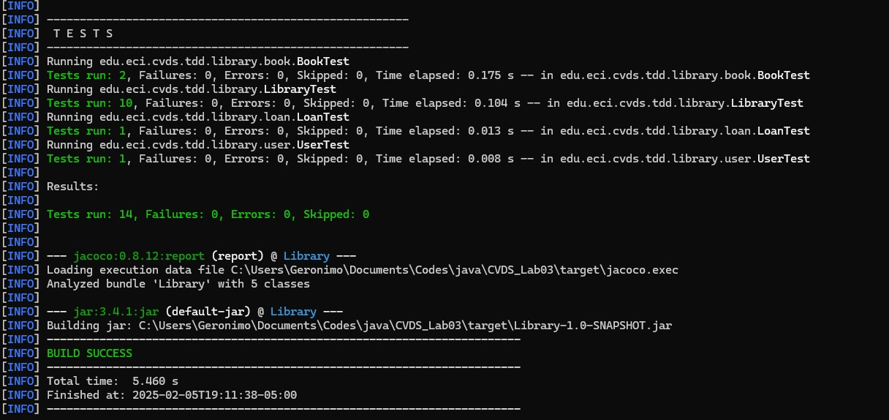

Ahora al compilar el proyecto en la carpeta ```target``` se debe crear una carpeta con el nombre site la cual tiene un ```index.html```, al abrir dicho archivo se debe ver la cobertura total y de cada una de las clases, el objetivo es tener la cobertura superior al 80%.
Explore los links del reporte en el cual le muestra que partes del código tienen prueba y cuales no.

-Aca podemos observar como la cobertura de pruebas esta superando el 80% establecido par el correcto funcionamiento del proyecto.

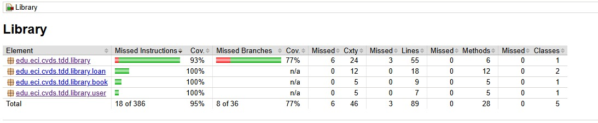

---

Ahora es necesario hacer el análisis estático del código usando SonarQube, para lo cual necesitamos tener Docker.

## Respuestas ✅
- Se debe descargar la imagen de docker con el siguiente comando ```docker pull sonarqube``` 
- Ahora se debe arrancar el servicio de SonarQube con el siguiente comando ```docker run -d --name sonarqube -e SONAR_ES_BOOTSTRAP_CHECKS_DISABLE=true -p 9000:9000 sonarqube:latest```
- Validar funcionamiento ```docker ps -a```

.png)

- Iniciar sesión en sonar ```localhost:9000``` cambiar la clave por defecto usuario y contraseña es admin.

.png)

- Entrar a las opciones de la cuenta.
  - Account -> settings -> generate token.
- Una vez sonar este corriendo deben generar un token

.png)
.png)

- Integración con sonar

.png)
.png)
.png)

- Añada el plugin de Sonar en el archivo pom del proyecto.


